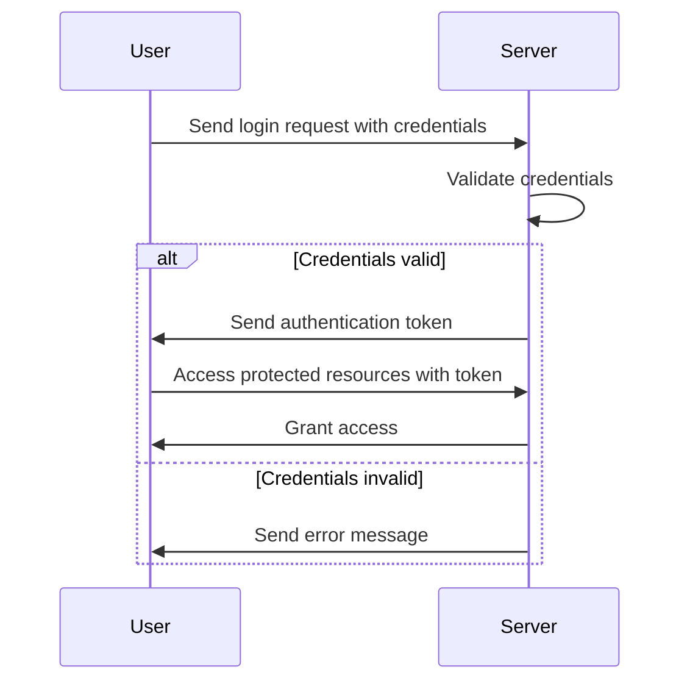
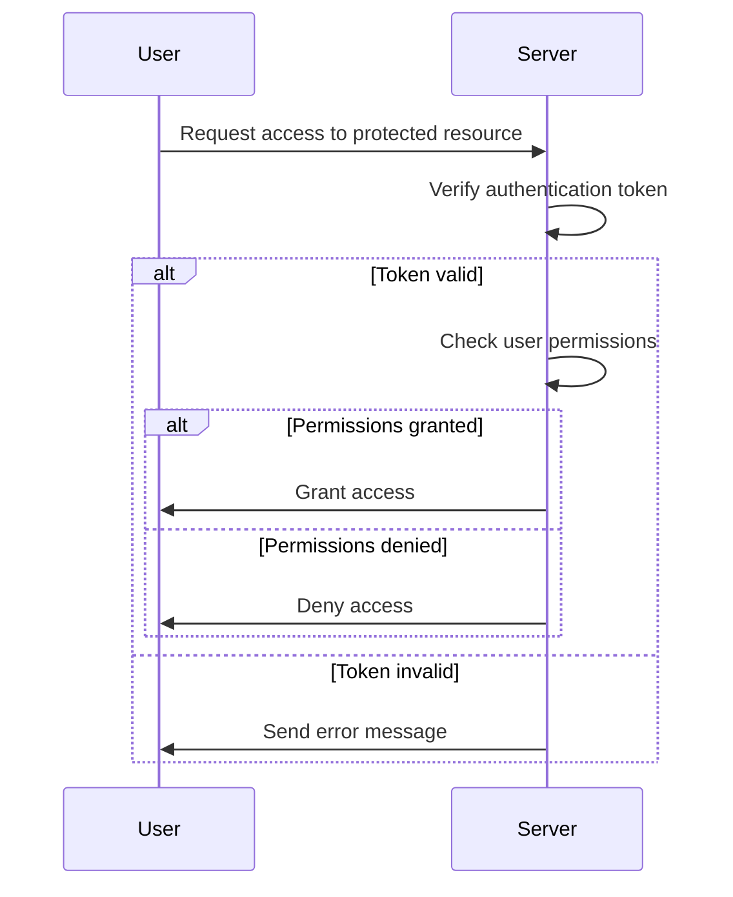

# Authentication and Authorization Flows

## Overview

This document provides an overview of the authentication and authorization flows for our application. It includes detailed steps and visual representations using Mermaid diagrams.

## Authentication Flow

### Steps

1. **User Request**: The user sends a login request with their credentials.
2. **Server Validation**: The server validates the credentials.
3. **Token Generation**: Upon successful validation, the server generates an authentication token.
4. **Token Response**: The server sends the authentication token back to the user.
5. **Access Granted**: The user includes the token in subsequent requests to access protected resources.

### Diagram

## Authorization Flow

### Steps

1. **User Request**: The user sends a request to access a protected resource.
2. **Token Verification**: The server verifies the authentication token.
3. **Permission Check**: The server checks if the user has the necessary permissions.
4. **Access Decision**: The server either grants or denies access based on the permissions.

### Diagram

## Conclusion

This document outlines the basic steps and flow diagrams for authentication and authorization processes. These flows ensure that only authenticated and authorized users can access protected resources in the application.

## References

- [okta.com - OAuth 2.0 and OpenID Connect overview](https://developer.okta.com/docs/concepts/oauth-openid/) --> [Implement the Authorization Code flow with PKCE](https://developer.okta.com/docs/guides/implement-grant-type/authcodepkce/main/)