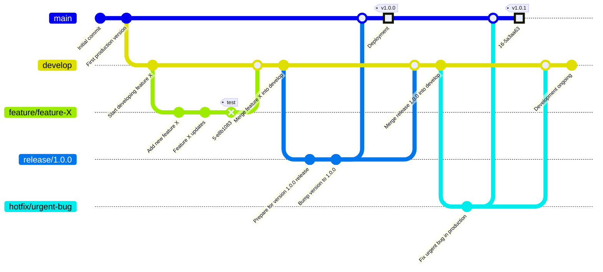

```mermaid
gitGraph 
    commit id: "Initial commit" 
    commit id: "First production version" 
    branch develop 
    checkout develop 
    commit id: "Start developing feature X" 

    %% Feature Branch 
    branch feature/feature-X 
    checkout feature/feature-X 
    commit id: "Add new feature X" 
    commit id: "Feature X updates"  
    commit tag:"test" type: REVERSE 
    checkout develop 
    merge feature/feature-X 
    commit id: "Merge feature X into develop" 

    %% Release Branch 
    branch release/1.0.0 
    checkout release/1.0.0 
    commit id: "Prepare for version 1.0.0 release" 
    commit id: "Bump version to 1.0.0" %%It means to increment the version number to a new, unique value. 
    checkout main 
    merge release/1.0.0 
    commit id: "Deployment" type: HIGHLIGHT tag: "v1.0.0" 
    checkout develop 
    merge release/1.0.0 
    commit id: "Merge release 1.0.0 into develop"  

    %% Hotfix Branch 
    branch hotfix/urgent-bug 
    checkout hotfix/urgent-bug 
    commit id: "Fix urgent bug in production" 
    checkout main 
    merge hotfix/urgent-bug 
    commit tag: "v1.0.1" type: HIGHLIGHT 
    %%commit id: "Deployment" type: HIGHLIGHT tag: "v1.0.1" 
    checkout develop 
    merge hotfix/urgent-bug  

    %% End 
    commit id: "Development ongoing" 
```
